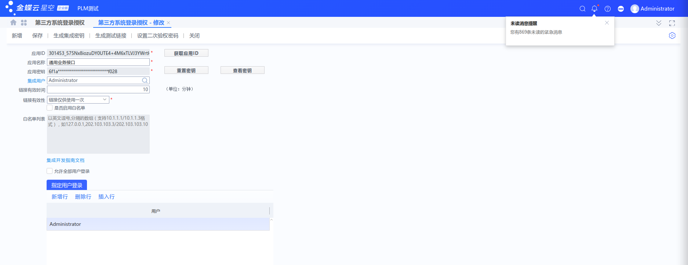

文件夹和文件说明:

产品唯一码：IBHC-LMFG-QIMZ-SCXH-QMVF

应用信息: YXBwaWQ6MzAxNDUxXzMzMjRlZTY3NzRkNDFhMGRkZWVkNDQwNjhjMjc4NTgzO3ZlcnNpb246MS4wO3R5cGU6MTt0YWc6SUJIQy1MTUZHLVFJTVotU0NYSC1RTVZGO2RiaWQ6O2RhdGE6QjByT0RJeC9zTEl5NzJWMmFWNHowdGhjMXhmNENsMCtjalBpUGFJYjg2MENJRFV3azBzaVNnVVlEVU9OOG5qSDlvdjB0L0VNQzJ4cXNOeDV5RjAyeHdITGhEeTY4MngvR0tMdWtydGdqUmw3dFRWUHRkMjNmRUNYcDE4eHlXVVBxZ1FNNWJ3WUJnVktBVyszL0hPbmYxRGgzNk96b2FnemNaZU5ZeElUZGZzPQ==

数据中心标识：66c3712248af25

FATAL: no pg_hba.conf entry for host "172.18.10.247", user "odoo", database "zyfire", SSL encryption

# 问题一：会话信息已丢失，请重新登录
### 问题多见于恢复数据库后，API授权信息丢失
{
	'Result': {
		'ResponseStatus': {
			'ErrorCode': 500,
			'IsSuccess': False,
			'Errors': [{
				'FieldName': None,
				'Message': '会话信息已丢失，请重新登录',
				'DIndex': 0
			}],
			'SuccessEntitys': [],
			'SuccessMessages': [],
			'MsgCode': 1
		}
	}
}
# 以上问题处理见下面提供链接
# 获得授权代码：具体参考如下文档 - 如何获取第三方登录授权?
https://vip.kingdee.com/article/298030366541838592?productLineId=1&isKnowledge=2&lang=zh-CN

# 问题二：请求参数存在可疑数据 caller_in_less_Point_Bracket
[{
	'actionname': 'showConfirm',
	'params': [{
		'title': '',
		'msg': '请求参数存在可疑数据,当前请求已经被拦截规则[caller_in_less_Point_Bracket]阻止!',
		'option': 0,
		'msgType': 0
	}]
}]

# 其他配置信息：
http://58.222.101.110:9090/k3cloud/   
账号： administrator	 Zyfire@2024   二次密码：Zyfire@2024!@#

